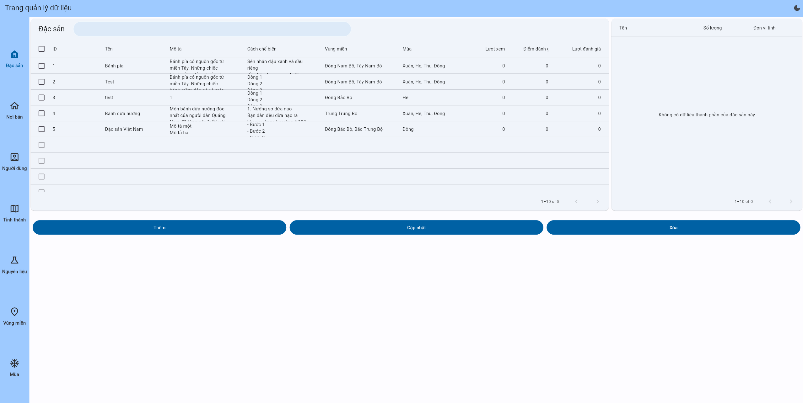
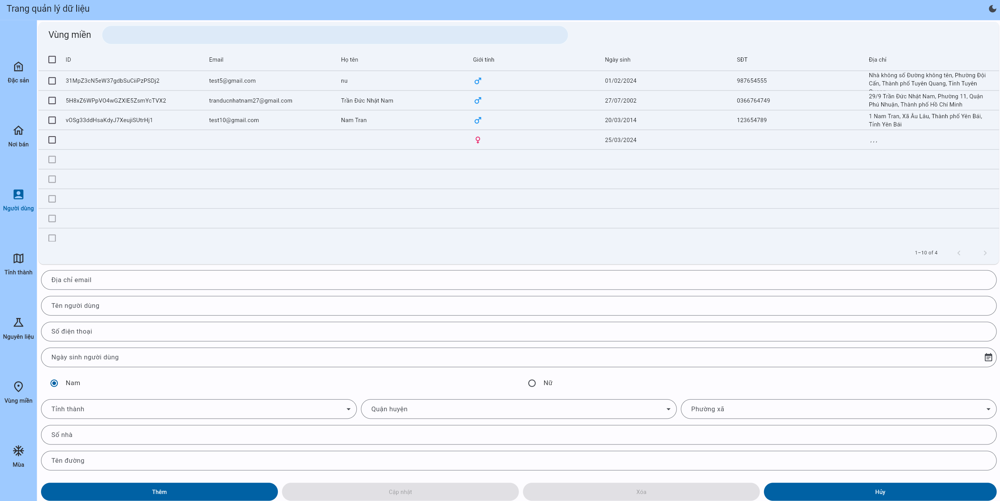

<!-- Improved compatibility of back to top -->
<a name="readme-top"></a>

<!-- PROJECT LOGO -->
<br />
<div align="center">
  <a href="https://github.com/Tran-Duc-Nhat-Nam/AppDacSan">
    
  </a>

<h3 align="center">VinaFood Web App</h3>

<p align="center">
  <a href="https://github.com/Tran-Duc-Nhat-Nam/AppDacSan/releases">Web app</a>
  |
  <a href="https://github.com/Tran-Duc-Nhat-Nam/AppDacSan/issues">Report Bug</a>
  |
  <a href="https://github.com/Tran-Duc-Nhat-Nam/AppDacSan/issues">Request Feature</a>
  <br />
  <p>-------------------------------------------------------------------------------</p>
  <h4 align="center">VinaFood project</h3>

  [![Android][Android-logo]][Android-url]
  [![Web][Web-logo]][Web-url]
  [![API][API-logo]][API-url]
</p>
</div>


<!-- TABLE OF CONTENTS -->
<details>
  <summary>Table of Contents</summary>
  <ol>
    <li>
      <a href="#about-the-project">About The Project</a>
      <ul>
        <li><a href="#built-with">Built With</a></li>
      </ul>
    </li>
    <li>
      <a href="#installation">Getting Started</a>
    </li>
    <li><a href="#usage">Usage</a></li>
    <li><a href="#contact">Contact</a></li>
  </ol>
</details>


<!-- ABOUT THE PROJECT -->
## About The Project

A web app to manage Vietnam specialties information for the Vinafood android app

<p align="right">(<a href="#readme-top">back to top</a>)</p>


### Built With

[![Dart][Dart-logo]][Dart-url]

[![Flutter][Flutter-logo]][Flutter-url]

[![Google Cloud web hosting][Google-cloud-logo]][Google-cloud-url]

<p align="right">(<a href="#readme-top">back to top</a>)</p>


<!-- GETTING STARTED -->
## Installation
### For user:

  Go to [here](https://musicplayerz-63f2e.web.app/)

### For developer:

1. Open an IDE or code editor

2. Clone the repo
   
   ```sh
   git clone https://github.com/Tran-Duc-Nhat-Nam/App_Quan_Ly_Dac_San.git
   ```

<p align="right">(<a href="#readme-top">back to top</a>)</p>


<!-- USAGE EXAMPLES -->
## Usage

* Read lists of items, users and locations

  
  
* Add, update and delete item

  

<p align="right">(<a href="#readme-top">back to top</a>)</p>


<!-- CONTACT -->
## Contact

Tran Duc Nhat Nam - [@Trần Đức Nhật Nam](https://www.facebook.com/nhatnam.tranduc) - tranducnhatnam27@gmail.com

Project Link: [https://github.com/Tran-Duc-Nhat-Nam/AppDacSan](https://github.com/Tran-Duc-Nhat-Nam/AppDacSan)

<p align="right">(<a href="#readme-top">back to top</a>)</p>

<!-- MARKDOWN LINKS & IMAGES -->
<!-- https://www.markdownguide.org/basic-syntax/#reference-style-links -->
[Android-logo]: https://img.shields.io/badge/android-000000?style=for-the-badge&logo=android&logoColor=lime
[Android-url]: https://github.com/Tran-Duc-Nhat-Nam/AppDacSan
[Web-logo]: https://img.shields.io/badge/web-000000?style=for-the-badge&logo=flutter&logoColor=dodgerblue 
[Web-url]: https://github.com/Tran-Duc-Nhat-Nam/App_Quan_Ly_Dac_San
[API-logo]: https://img.shields.io/badge/api-000000?style=for-the-badge&logo=go&logoColor=deepskyblue
[API-url]: https://github.com/Tran-Duc-Nhat-Nam/DacSanAPI
[Flutter-logo]: https://img.shields.io/badge/flutter-000000?style=for-the-badge&logo=flutter&logoColor=dodgerblue 
[Flutter-url]: https://flutter.dev/
[Dart-logo]: https://img.shields.io/badge/dart-000000?style=for-the-badge&logo=flutter&logoColor=deepskyblue 
[Dart-url]: https://dart.dev/
[Google-cloud-logo]: https://img.shields.io/badge/google%20cloud%20web%20hosting-000000?style=for-the-badge&logo=google&logoColor=cyan
[Google-cloud-url]: https://cloud.google.com/solutions/web-hosting
